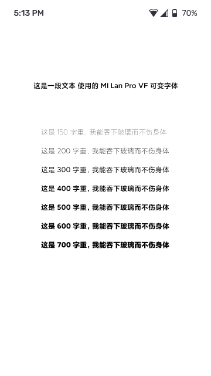

# Text•控件（待完成）

## 使用场景
「Text」是一个很常见的控件，它可以用来显示文本。比如你现在正在阅读的这篇文章应该就是用它来实现的

## 参数
Text 有很多可以自定义参数，如:

1. 字号
2. 文字
3. 颜色
4. 字体
5. 字间距

等一些可以调节的参数。

我们可以通过这些参数来自定义 Text 控件，展示想要的文本内容。

## 实例
因为我们经常使用 Text 控件，所以我想讲一些稍微小众实例，让大家对 Text 更加了解。

### 字重
我们在 Text 经常使用下面方法来设置字体加粗。

方法一
``` java
TextView tv = (TextView)findViewById(R.id.textView);
TextPaint tp = tv .getPaint();
tp.setFakeBoldText(true);
```

方法二
``` java
TextView tv = (TextView)findViewById(R.id.textView);
tv.setTypeface(Typeface.defaultFromStyle(Typeface.BOLD));
```
或者在 xml TextView 中加入下面
``` xml
android:textStyle="bold"
```

方法一是让画笔加粗，方法二是使用对应的加粗字体。

他们各有优劣，方法一是一定会让字体变粗，但是会丢失字体细节，方法二取决于系统是否存在 **Bold** 字体，如果不存在，则和不设置加粗一样的效果。而且对于设计师来说，这两个都只有单一变化，在应用中只有**标准**和**加粗**两个字重，并不能达到下面的效果。



更不要说如下文这样流畅的动画

<video id="video" controls="" preload="none">
<source id="mp4" src="https://video.zcool.cn/e9817e6e6c5a446b974c0c8564ed442e/d948145f7a934dcf8900eb1a1731ef68-5287d2089db37e62345123a1be272f8b.mp4?auth_key=1655376191-80600739730446d09df559dec61e0eb9-0-e95bb74d083e0669a39186bfa4d3b161" type="video/mp4">
</video>

这时候我们要祭出一个属性，他的名字叫**fontFamily**

```
android:fontFamily
```
他可以通过 fontFamily 属性来设置字体字重，可以调用系统预设的字体字重，或者自定义的字体字重。

## 参考链接 
[交互控件 《这个控件叫什么？》](https://www.uisdc.com/zt/interactive-control)
[MIUI 动态字体系统 - 小米兰亭Pro](https://www.zcool.com.cn/work/ZNDE1MDQ2MDg=.html)